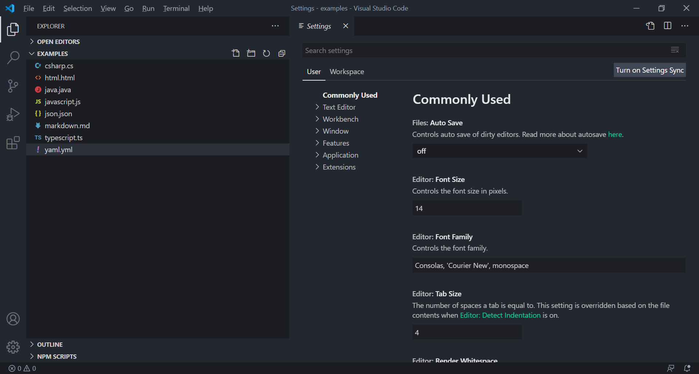
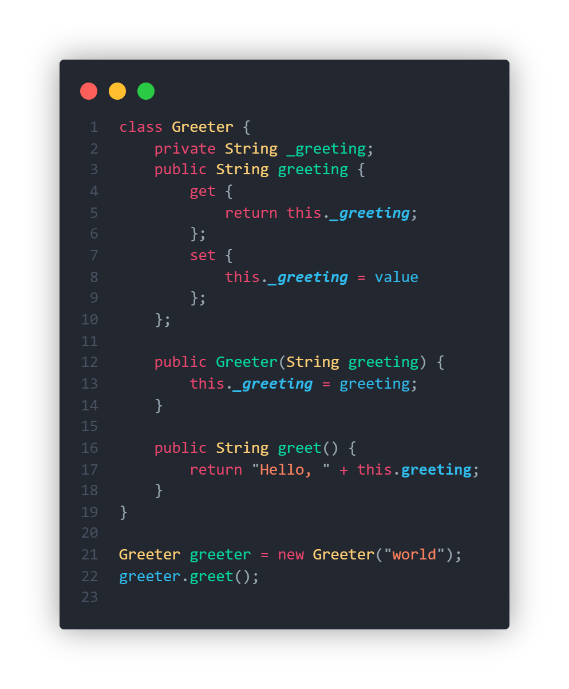
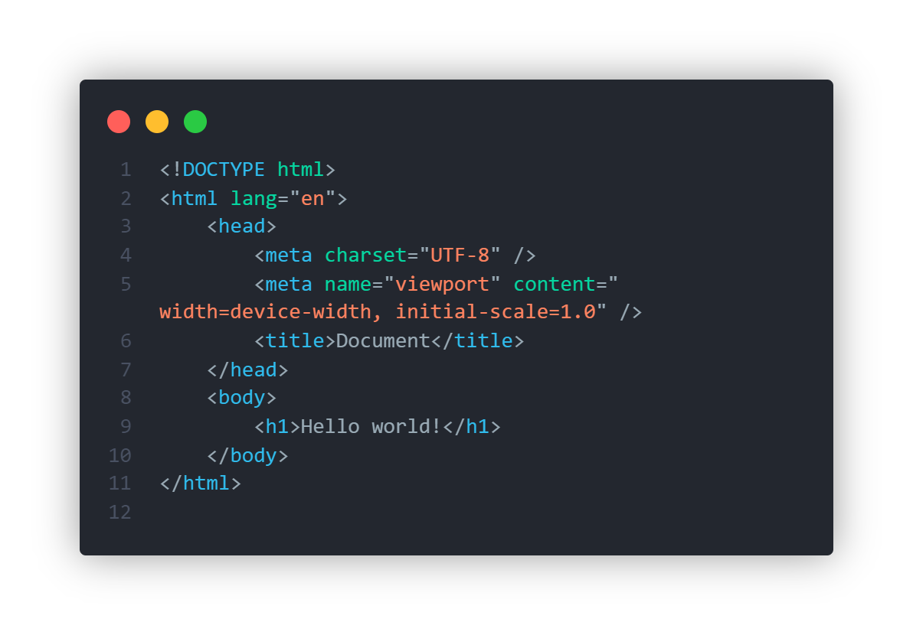
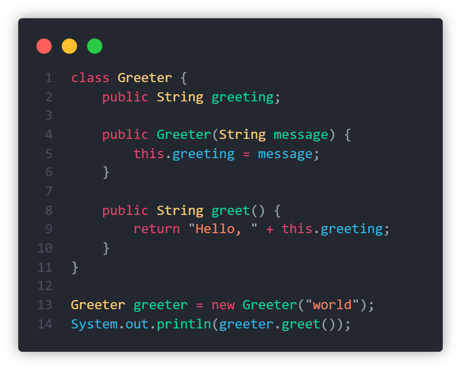
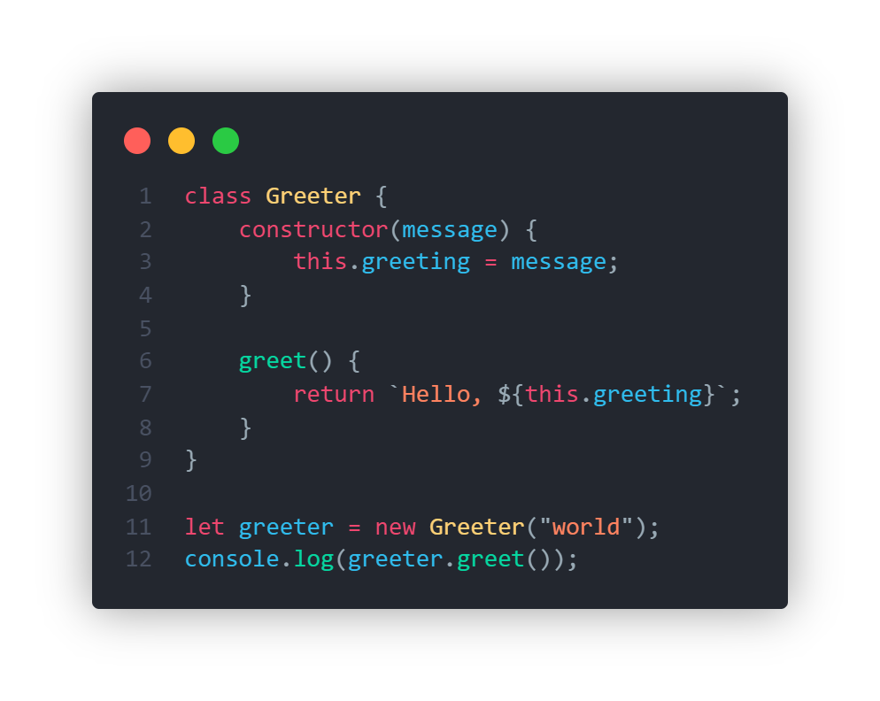
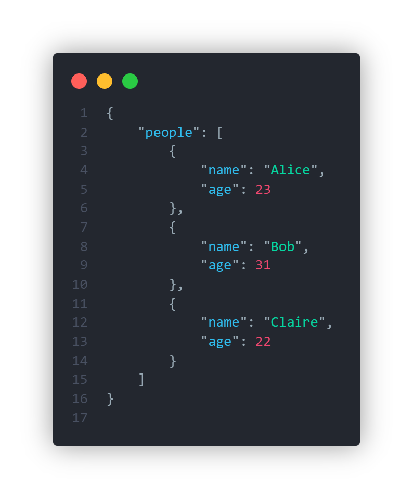
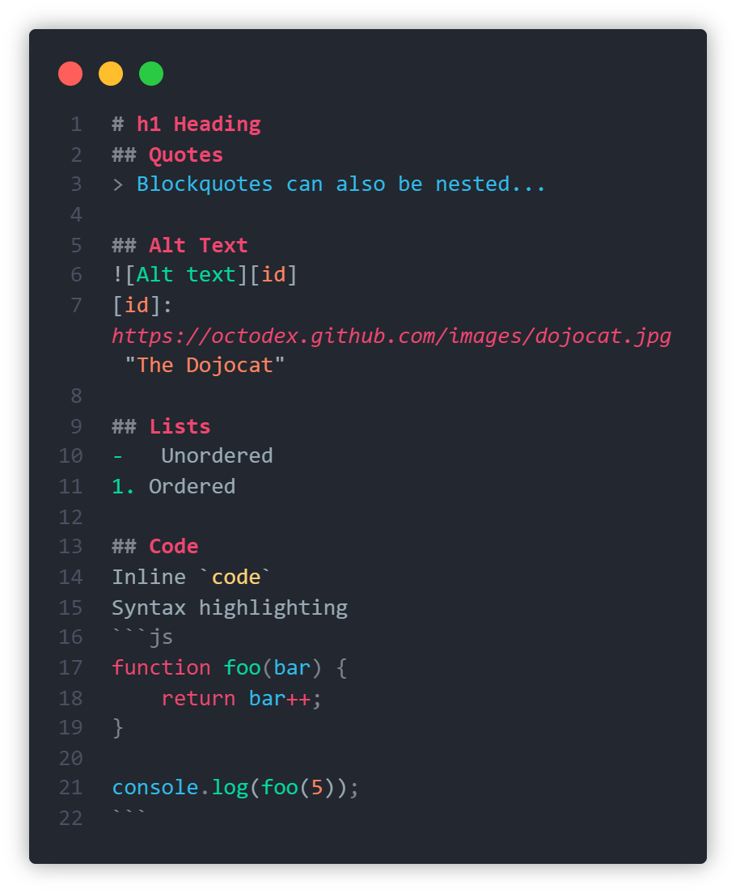
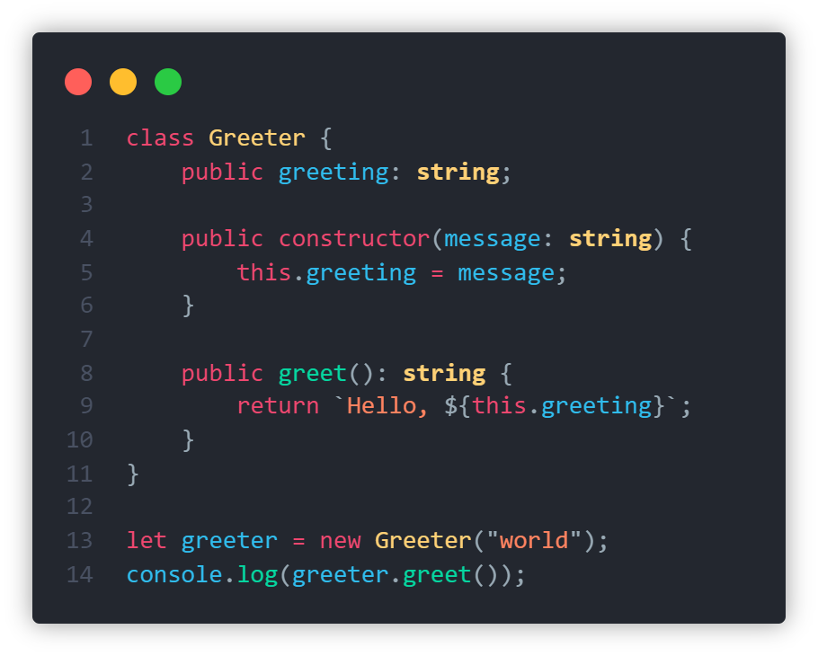
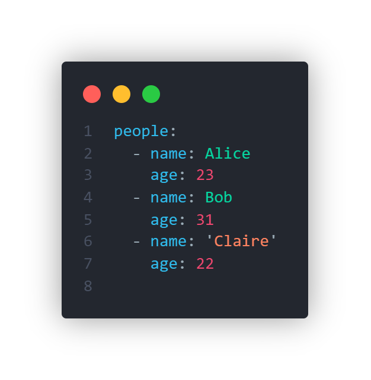

# Theme³

This extension offers a material theme with dark UI and vibrant text colors.

## Screenshots

### UI

> **Settings:** 

### Languages

Below are screenshot of the theme for some languages, to give you an idea of what the theme feels like.

> **C#**: C# also has an addition of making properties **bold** and fields that start with a '\_' _italic_. 

> **HTML**: 

> **Java**: 

> **JavaScript**: 

> **JSON**: 

> **Markdown**: 

> **TypeScript**: 

> **YAML**: 
